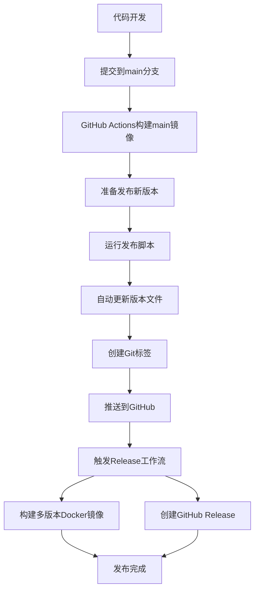

# 📋 WeComProxy 发布指南

完整的CI/CD和版本发布流程说明，跟着操作即可完成专业级的版本发布。

## 🎯 发布流程概览



## 🚀 Step-by-Step 发布指南

### 📋 准备工作 (一次性设置)

**1. 确认环境**
```bash
# 检查Git配置
git --version
git config user.name
git config user.email

# 确认在项目根目录
cd D:\Code\WeComProxy
```

**2. 确认权限**
- ✅ GitHub仓库有写入权限
- ✅ 可以推送到main分支
- ✅ 可以创建标签

### 🔄 日常开发流程

**Step 1: 开发功能**
```bash
# 创建功能分支 (可选)
git checkout -b feature/new-feature

# 开发代码...
# 修改文件...

# 提交更改
git add .
git commit -m "feat: add new awesome feature"
```

**Step 2: 推送到main分支**
```bash
# 切换到main分支
git checkout main

# 合并功能分支 (如果使用了分支)
git merge feature/new-feature

# 推送到远程
git push origin main
```

**自动结果**:
- ✅ GitHub Actions自动构建
- ✅ 生成 `ghcr.io/andywangm/wecomproxy:main` 镜像
- ✅ 可在Actions页面查看构建状态

### 🎉 版本发布流程

#### **Step 1: 决定版本号**

根据变更类型选择版本号：

| 变更类型 | 版本示例 | 说明 |
|---------|----------|------|
| Bug修复 | `1.0.0` → `1.0.1` | PATCH版本 |
| 新功能 | `1.0.1` → `1.1.0` | MINOR版本 |
| 破坏性变更 | `1.1.0` → `2.0.0` | MAJOR版本 |

#### **Step 2: 运行发布脚本**

**Windows用户:**
```batch
# 进入项目目录
cd D:\Code\WeComProxy

# 运行发布脚本
scripts\release.bat 1.0.1
```

**Linux/macOS用户:**
```bash
# 进入项目目录
cd /path/to/WeComProxy

# 运行发布脚本
./scripts/release.sh 1.0.1
```

#### **Step 3: 按照脚本提示操作**

脚本会显示类似输出：
```
🚀 WeComProxy Release Script

ℹ️  Preparing release for version 1.0.1

⚠️  This will:
  1. Update package.json version
  2. Update CHANGELOG.md
  3. Commit changes
  4. Create and push tag v1.0.1
  5. Trigger GitHub Actions to build Docker images
  6. Create GitHub Release automatically

Continue with release? (y/N):
```

**输入 `y` 确认继续**

#### **Step 4: 编辑变更日志**

脚本会自动打开CHANGELOG.md文件，请编辑：

```markdown
## [1.0.1] - 2024-03-24

### Added
- 新增消息模板功能
- 添加用户ID获取工具

### Changed
- 优化Docker镜像大小
- 改进错误处理机制

### Fixed
- 修复Token刷新问题
- 解决配置文件热更新bug
```

**编辑完成后保存并关闭文件**，然后按任意键继续。

#### **Step 5: 等待自动完成**

脚本会自动执行：
```
ℹ️  Updating package.json version to 1.0.1
✅ Updated package.json
ℹ️  Committing version changes...
✅ Committed version changes
ℹ️  Pushing changes to origin...
✅ Changes pushed to origin
ℹ️  Creating tag v1.0.1
✅ Created tag v1.0.1
ℹ️  Pushing tag to origin...
✅ Tag pushed to origin
```

#### **Step 6: 验证发布结果**

**1. 查看GitHub Actions状态:**
- 访问: https://github.com/AndyWangM/WeComProxy/actions
- 确认两个workflow都在运行:
  - ✅ `Build and Push Docker Image`
  - ✅ `Release`

**2. 查看Docker镜像:**
等待构建完成后，访问: https://github.com/AndyWangM/WeComProxy/pkgs/container/wecomproxy

应该看到新的镜像标签:
- ✅ `v1.0.1`
- ✅ `1.0`
- ✅ `1`
- ✅ `latest`

**3. 查看GitHub Release:**
- 访问: https://github.com/AndyWangM/WeComProxy/releases
- 确认新版本Release已创建
- 包含详细的使用说明和Docker命令

## 🔧 故障排除

### 常见问题及解决方案

**问题1: 脚本提示"Git工作目录不干净"**
```bash
# 查看状态
git status

# 提交或暂存更改
git add .
git commit -m "fix: resolve pending changes"

# 或者暂存更改
git stash
```

**问题2: 脚本提示"版本已存在"**
```bash
# 查看现有标签
git tag

# 删除本地标签 (如果需要)
git tag -d v1.0.1

# 删除远程标签 (谨慎操作!)
git push origin --delete v1.0.1
```

**问题3: GitHub Actions构建失败**
1. 访问Actions页面查看错误日志
2. 常见原因：Docker构建错误、依赖问题
3. 修复后重新推送标签:
   ```bash
   git tag -d v1.0.1
   git push origin --delete v1.0.1
   git tag -a v1.0.1 -m "Release version 1.0.1"
   git push origin v1.0.1
   ```

**问题4: 权限错误**
- 确认GitHub Token权限
- 检查仓库访问权限
- 确认可以推送到main分支

## 📊 发布后验证清单

### ✅ 必须检查项

- [ ] GitHub Actions构建成功
- [ ] Docker镜像成功推送到ghcr.io
- [ ] GitHub Release页面创建成功
- [ ] 版本号在package.json中正确更新
- [ ] CHANGELOG.md包含最新版本信息

### 🧪 功能验证

**拉取并测试新镜像:**
```bash
# 拉取最新镜像
docker pull ghcr.io/andywangm/wecomproxy:1.0.1

# 启动测试
docker run -d \
  --name wecom-proxy-test \
  -p 3001:3000 \
  -v ./test-data:/app/data \
  ghcr.io/andywangm/wecomproxy:1.0.1

# 测试访问
curl http://localhost:3001/api/stats

# 清理测试容器
docker stop wecom-proxy-test
docker rm wecom-proxy-test
```

## 🎯 发布最佳实践

### 📋 发布前检查

1. **功能完整性**
   - 所有新功能已测试
   - 现有功能未被破坏
   - 文档已更新

2. **版本规划**
   - 确定正确的版本号类型
   - 准备详细的变更说明
   - 考虑兼容性影响

3. **时机选择**
   - 避免在周五下午发布
   - 预留时间处理可能的问题
   - 通知相关用户

### 🔄 发布节奏建议

- **热修复** (PATCH): 随时发布，解决紧急问题
- **功能更新** (MINOR): 每2-4周，包含新功能
- **大版本** (MAJOR): 每季度或半年，重大架构变更

### 📢 发布通知

发布完成后，可以：
1. 在项目README中更新版本信息
2. 通知用户升级到新版本
3. 在相关社区分享更新内容

## 🔗 相关链接

- **GitHub仓库**: https://github.com/AndyWangM/WeComProxy
- **Docker镜像**: https://github.com/AndyWangM/WeComProxy/pkgs/container/wecomproxy
- **Actions状态**: https://github.com/AndyWangM/WeComProxy/actions
- **Release页面**: https://github.com/AndyWangM/WeComProxy/releases
- **Issues反馈**: https://github.com/AndyWangM/WeComProxy/issues

---

**完成发布后，恭喜你！🎉 你刚刚完成了一次专业级的软件版本发布！**